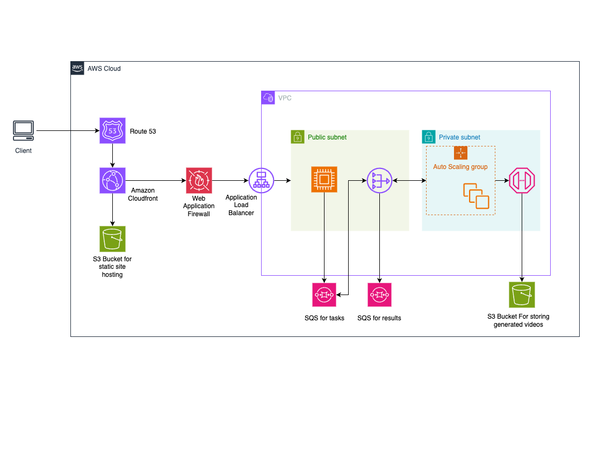

# Manimatic: Math Animations with Natural Language

Manimatic is an app for creating animations with [Manim](https://docs.manim.community/) (a popular engine for explanatory math videos). Instead of writing Python code manually, you can describe your animation in plain language, and the app generates the code for you, compiles it, and returns both the animation video and the code. An integrated editor lets you tweak the generated script and recompile with your changes. Try it out at: [https://manimatic.adelh.dev/](https://manimatic.adelh.dev/)


---

## Features
- **Natural Language Animation Creation:** Generate Manim animations with ease.
- **Integrated Code Editor:** Edit and recompile generated Python scripts directly in the app.
- **Video Delivery:** Automatically compiles, uploads, and serves animations.

---

## Built With
- **Backend:** Golang
- **Frontend:** React
- **Infrastructure:** AWS Cloud Development Kit (CDK) in TypeScript for Infrastructure-as-Code (IaC).

### Architecture Overview
The app comprises:
1. **Prompt Handling API:** Receives prompts and generates Python scripts using GPT-4.
2. **Task Queue:** Scripts are pushed to an SQS queue for processing.
3. **Worker Instance:** Compiles Python code into video, uploads to S3, and returns signed URLs.
4. **Client Updates:** Uses Server-Sent Events (SSE) to push results (code + video) to the frontend.



---

## Getting Started Locally
There are two ways to run the application locally:

### Option 1: Using Docker Compose
1. Clone this repository:
    ```sh
    git clone https://github.com/theadell/manimatic
    ```
2. Save your OpenAI API key:
    ```sh
    echo "your-api-key" > openai_api_key.secret
    ```
3. Start with Docker Compose:
    ```sh
    docker-compose up
    ```
4. Run the frontend:
    ```sh
    cd frontend
    npm install
    npm run dev
    ```
Access the app at [http://localhost:5173](http://localhost:5173)

- Docker and Docker Compose
- LocalStack for mocking AWS services
- OpenAI API Key

### Option 2: Locally Using Task Runner
Prerequisites:
- Task - Task runner for development workflows
- Docker - For running LocalStack
- Go 1.21 or later
- Node.js and npm
- OpenAI API Key
- AWS CLI

1. Clone the repository as above and set up your OpenAI API key
2. Start the local development environment:
    ```sh
    task dev
    ```
    This will set up LocalStack and required AWS resources
3. Start the services (in separate terminals):
    ```sh
    # Start the API server
    task dev:api

    # Start the worker
    task dev:worker

    # Start the frontend
    task dev:front 
    ```
Access the app at [http://localhost:5173](http://localhost:5173)
